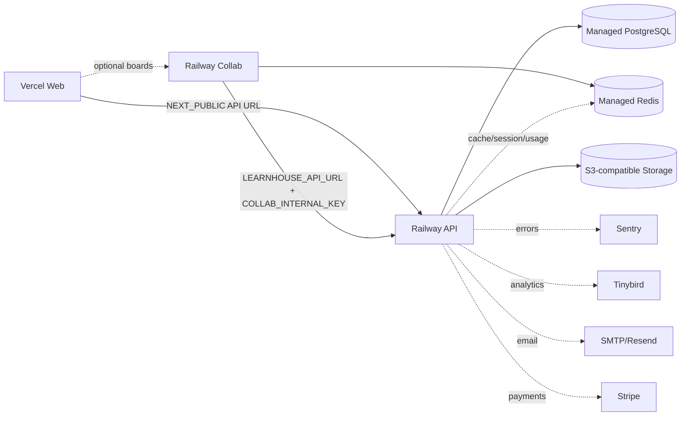

# Service Dependencies

| Service | Mandatory dependencies | Optional dependencies | Degraded mode |
|---|---|---|---|
| Web | Build toolchain, API base URL/domain for integrated flows | PostHog, public Sentry DSN, Unsplash key, Collab UI consumers | Public/landing pages can render with limited API integration; app flows require API |
| API | PostgreSQL/SQL connection, strong JWT secret, configured port/domain/CORS | Redis, S3, Sentry, Tinybird, Stripe, email, AI, Judge0, Loops | Some cache/token revocation/usage features degrade without Redis; health still requires DB |
| Collab | JWT secret, internal key, API URL, Redis connection for ydoc cache | Trusted proxy flag | Can be omitted for MVP if collaborative boards are out of scope |
| PostgreSQL | Managed database, migration path, backup/restore | pgvector for AI/RAG | No real staging without persistent DB |
| Redis | Managed Redis if enabling token revocation scale, usage counters, Collab cache | N/A | API has some fallback paths; Collab expects Redis URL |
| Storage | Filesystem local dev or S3-compatible staging/prod | CDN/presigned acceleration | Filesystem is unsafe on ephemeral production platforms |

## Mermaid dependency map

