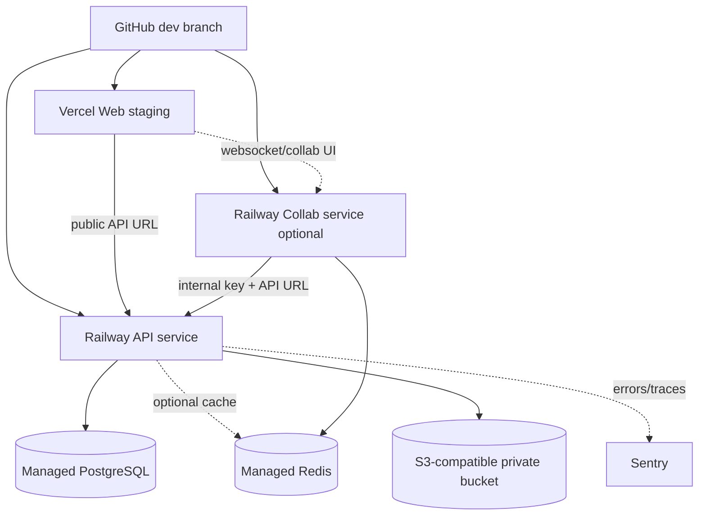

# Staging Topology

## Contracts

- Web is independently built but functionally depends on API URLs and tenant/domain config.
- API owns secrets, persistence, auth, RBAC, storage, email, billing and AI integrations.
- Collab is isolated as a separate Railway service if MVP scope requires it.
- PostgreSQL is mandatory; Redis is feature-dependent for API and required for Collab.
- Storage must be S3-compatible for staging/production media.
