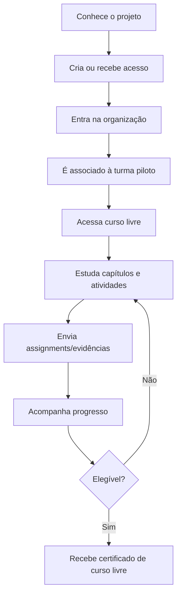
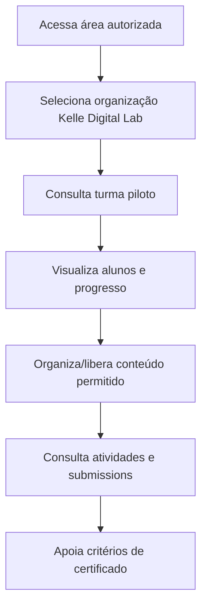
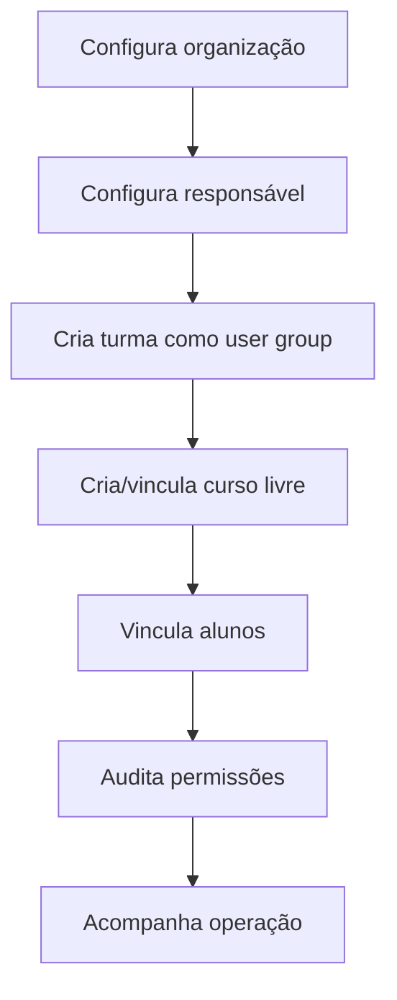

# Jornadas do piloto

## Pré-condições

- Organização Kelle Digital Lab existe como tenant/organização.
- Professora e alunos pertencem à organização correta.
- Turma piloto existe como user group.
- Curso livre foi criado e vinculado à organização.
- Certificado usa texto de curso livre e projeto educacional independente.

## Aluno

## Professora Kelle

## Operador XpeX

## Estados principais

| Objeto | Estados atuais/reutilizáveis | Observação |
|---|---|---|
| Curso | `public`, `published` | Controla exposição e publicação |
| Capítulo | `lock_type` | Controla bloqueio e acesso do capítulo |
| Atividade | `lock_type`, `published` | Controla bloqueio e publicação da atividade |
| Trail run | `STATUS_IN_PROGRESS`, `STATUS_COMPLETED`, `STATUS_PAUSED`, `STATUS_CANCELLED` | Base para progresso |
| Assignment | `published`, grading type, submission state nos serviços | Base para evidências práticas |
| Certificado | Configuração por curso e emissão por usuário | Exige texto de curso livre |

## Exceções e lacunas

- Aluno sem organização não deve acessar conteúdo restrito.
- Aluno fora da turma não deve acessar recursos de turma se lock/user group for usado.
- Professora com papel amplo pode visualizar mais que a turma; isso deve ser mitigado por custom role ou escopo operacional.
- Presença síncrona e portfólio consolidado não têm entidade dedicada encontrada.
