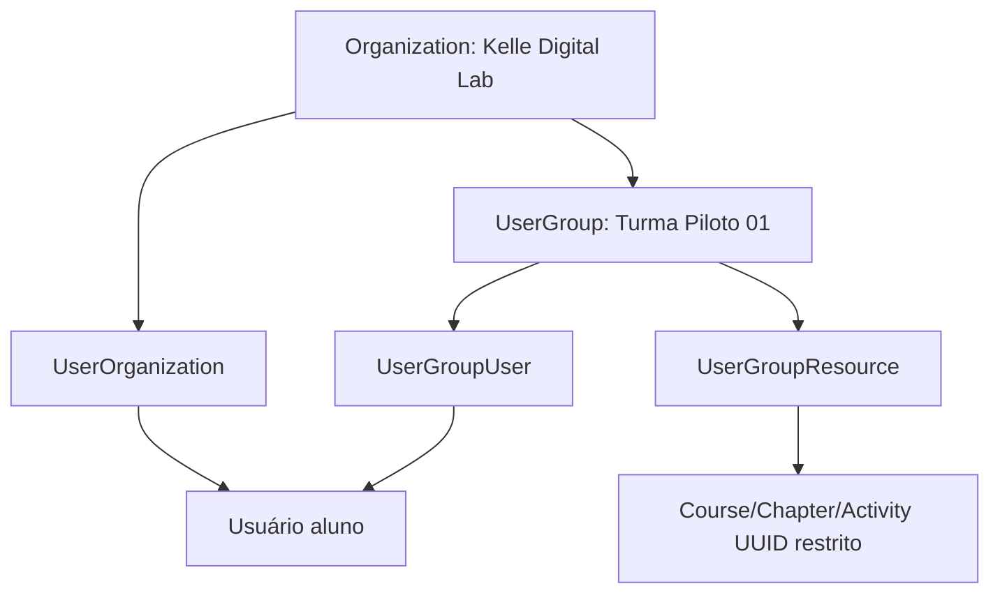

# Class Group Blueprint — Turma Piloto 01

## Decisão documental

Representar a turma piloto como `UserGroup` existente, com membros por `UserGroupUser` e liberação de recursos por `UserGroupResource`.

## Campos

| Entidade | Campos essenciais | Convenção |
|---|---|---|
| `UserGroup` | `name`, `description`, `org_id` | `Turma Piloto 01 — Informática Básica com IA` |
| `UserGroupUser` | `usergroup_id`, `user_id`, `org_id` | apenas usuários já associados à organização |
| `UserGroupResource` | `usergroup_id`, `resource_uuid`, `org_id` | vincular course/chapter/activity restritos conforme política |

## Regras de acesso

1. Todo aluno precisa estar em `UserOrganization` da Kelle Digital Lab antes de entrar em `UserGroupUser`.
2. `UserGroupResource` deve apontar somente para recursos com o mesmo `org_id`.
3. Recursos com `lock_type=restricted` só ficam acessíveis quando o usuário pertence ao user group vinculado.
4. Admin/Maintainer podem bypassar locks; por isso, operação diária deve usar menor privilégio.

## Mermaid

## Checklist futuro

- [ ] Criar user group somente após organização aprovada.
- [ ] Validar que cada aluno pertence ao mesmo `org_id`.
- [ ] Vincular recursos restritos somente após curso, chapters e activities revisados.
- [ ] Conferir amostra de aluno dentro e fora da turma antes de publicar.
