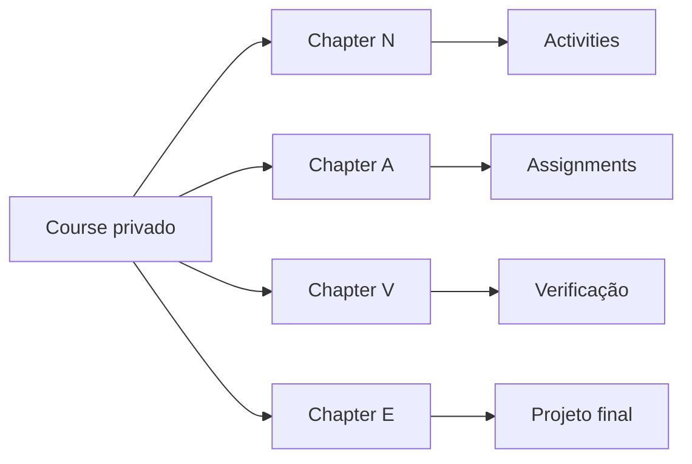

# Course Blueprint — Informática Básica com Inteligência Artificial

## Decisão documental

Criar futuramente um `Course` privado/restrito, estruturado por `Chapter` para representar o Método NAVE IA e `Activity`/`Assignment` para aulas e práticas. Esta missão não cria curso real.

## Configuração candidata do Course

| Campo | Valor documental inicial |
|---|---|
| `name` | `Informática Básica com Inteligência Artificial` |
| `description` | `Curso livre introdutório de informática básica com apoio de inteligência artificial.` |
| `about` | `Projeto educacional independente.` |
| `learnings` | Objetivos curriculares aprovados em missão futura |
| `tags` | `curso-livre, informatica-basica, inteligencia-artificial` |
| `thumbnail_type` | `image` |
| `public` | `false` |
| `published` | `false` até checklist final |
| `open_to_contributors` | `false` |
| `seo` | `robots_noindex=true` se usado antes de publicação pública |
| `extra_metadata` | Metodologia, compliance e status documental |

## Método NAVE IA sem novo banco

| Letra | Chapter documental | Metadata sugerida | Objetivo |
|---|---|---|---|
| N | `N — Navegar` | `{"nave_step":"N","nave_label":"Navegar"}` | Alfabetização digital, ambiente, segurança básica |
| A | `A — Aplicar` | `{"nave_step":"A","nave_label":"Aplicar"}` | Uso prático de ferramentas digitais |
| V | `V — Verificar` | `{"nave_step":"V","nave_label":"Verificar"}` | Checagem, revisão, qualidade e segurança |
| E | `E — Evoluir` | `{"nave_step":"E","nave_label":"Evoluir"}` | Projeto final, autonomia e próximos passos |

## Activities e Assignments

- Aulas expositivas podem usar `TYPE_DOCUMENT`, `TYPE_VIDEO`, `TYPE_DYNAMIC` ou `TYPE_CUSTOM` conforme conteúdo real.
- Práticas avaliáveis devem usar `TYPE_ASSIGNMENT` e registro em `Assignment`.
- Assignments devem iniciar `published=false` e só abrir após revisão de tarefas, critérios e dados solicitados.
- Evitar upload de documentos pessoais no MVP.

## Mermaid

