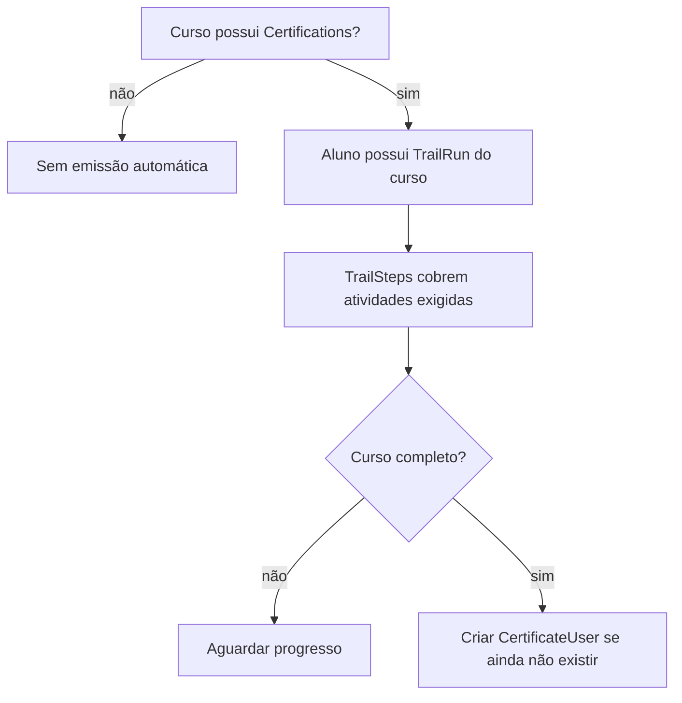

# Certification Flow — Learning Core

## Configuração

Certificação é configurada por curso em `Certifications.config`. O MVP deve declarar wording de **curso livre** e **projeto educacional independente** antes de habilitar emissão operacional.

## Elegibilidade

## Emissão

A emissão atual deve reutilizar `CertificateUser` associado a `user_id` e `certification_id`. Não criar tabela paralela de certificados.

## Verificação

A verificação pública/operacional deve usar as rotas e páginas existentes de certificado. Se o wording ou layout precisar mudar, isso é missão funcional futura, não MISSION-005.

## Revogação ou correção

Não foi identificada política operacional completa de revogação/correção como capacidade pronta para o piloto. Tratar como lacuna P1 antes de certificados reais em produção.

## Wording de curso livre

Texto obrigatório recomendado para futuras telas/documentos: “Certificado de conclusão de curso livre emitido pela XpeX Academy/Kelle Digital Lab como projeto educacional independente, sem equivalência automática a diploma, crédito acadêmico ou vínculo universitário.”

## Riscos de compliance

- Prometer certificação universitária, emprego, renda ou carga horária sem fonte oficial.
- Emitir certificado sem critérios auditáveis.
- Permitir correção manual sem trilha de auditoria.
