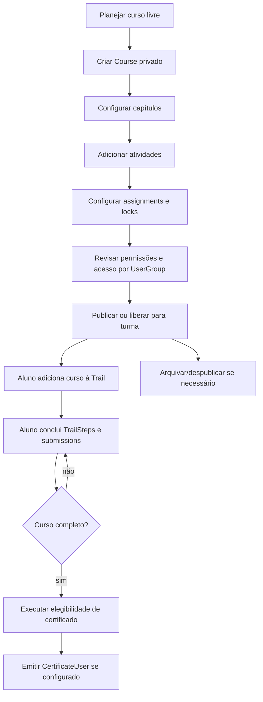

# Course Lifecycle — Learning Core

## Criação

Criar curso deve usar `Course` existente em `apps/api/src/db/courses/courses.py` e serviço `create_course` em `apps/api/src/services/courses/courses.py`, respeitando permissão de criação na organização.

## Configuração

Capítulos usam `Chapter`/`CourseChapter`; atividades usam `Activity`/`ChapterActivity`. Atividades suportam tipos de conteúdo como vídeo, documento, dinâmico, custom e assignment no modelo atual.

## Publicação

`Course` possui flags `public` e `published`. O serviço de cursos diferencia acesso anônimo, publicado, público, autores e membros de usergroup. Para MVP privado, preferir curso não público e acesso por `UserGroupResource`.

## Controle de acesso

Acesso deve combinar RBAC, autoria e user groups. Locks de capítulo/atividade podem ocultar conteúdo/detalhes para usuários sem grupo correto. O Platform Core continua dono de autenticação, papéis e sessão.

## Execução

Aluno acessa curso/atividade e o progresso é persistido via trail. Assignment pode gerar task submissions e user submission agregada.

## Progresso

`TrailStep.complete=True` por atividade alimenta a conclusão de curso. Não há cálculo de presença ou tempo mínimo como capacidade comprovada para MVP.

## Conclusão

A conclusão deve ser calculada por atividades do curso e TrailSteps. Assignments podem compor avaliação, mas critérios pedagógicos finais precisam de missão própria.

## Certificação

Quando o curso está completo, serviço de assignment/trail aciona checagem de certificado. A emissão só deve ocorrer se houver configuração de certificado do curso.

## Arquivamento ou rollback

Rollback documental: despublicar curso, remover associação de usergroup ao recurso e preservar dados. Não excluir dados reais sem política operacional futura.
