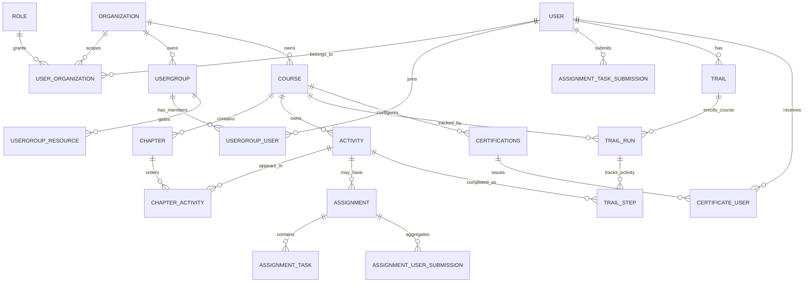

# Entity Relationship Mapping — Learning Core

## Diagrama Mermaid

## Cardinalidades conhecidas

- `Organization` escopa cursos, user groups, atividades, capítulos, trail runs e trail steps por `org_id`.
- `UserOrganization` liga usuário, organização e papel; `Role.rights` é a fonte de permissões.
- `UserGroupUser` liga aluno/professora a uma turma/grupo; `UserGroupResource` liga grupos a recursos por UUID.
- `Course` possui `Chapter` e `Activity`; `ChapterActivity` preserva a relação/ordem entre capítulo e atividade.
- `Trail` é por usuário e organização; `TrailRun` representa a execução/enrollment de um curso; `TrailStep` registra conclusão por atividade.
- `Certifications` configura certificado por curso; `CertificateUser` liga certificado emitido ao usuário.

## Escopo por `org_id`

O blueprint assume isolamento por `org_id` porque os modelos de cursos, atividades, capítulos, trilhas, grupos e associações usam chaves para `organization.id`. Inferência: qualquer implementação futura deve validar `org_id` em leituras e escritas, não apenas UUID de recurso.

## Associações de turma

A turma do MVP deve ser `UserGroup` com alunos em `UserGroupUser` e recursos liberados em `UserGroupResource`. Isso reutiliza a checagem de acesso por grupo no RBAC e nos locks de conteúdo.

## Relações de curso

Curso é o agregado pedagógico principal; capítulos e atividades pertencem ao curso, assignments ficam ligados a activity/chapter/course e submissões ficam ligadas a user + assignment/task.

## Progresso

Enrollment não aparece como entidade dedicada. No sistema atual, a matrícula operacional deve ser tratada como `TrailRun` criado por `/trail/add_course/{course_uuid}` depois de existir uma `Trail` por usuário/org.

## Certificado

A elegibilidade deve continuar derivada da conclusão de atividades/curso e da existência de configuração `Certifications`; a emissão persiste em `CertificateUser`.

## Inferências marcadas

- **Inferência:** `UserGroup` cobre turma/cohort do piloto, mas não substitui presença, agenda, diário de classe ou coorte analítica formal.
- **Inferência:** `TrailRun` é o melhor equivalente atual de enrollment, mas não carrega contrato comercial, pagamento, turma ou janela de oferta por si só.
