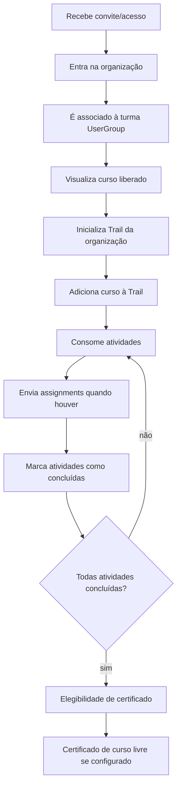

# Student Journey — Learning Core

## Pré-condições

- Usuário autenticado e associado à `Organization` por `UserOrganization`.
- Usuário incluído em `UserGroupUser` da turma quando o curso for privado/restrito.
- Curso configurado com capítulos, atividades publicadas/liberadas e política de certificado.

## Fluxo Mermaid

## Estados

- Sem organização: não deve acessar ambiente privado.
- Na organização, fora da turma: pode não ver curso privado/restrito.
- Na turma, sem TrailRun: tem acesso, mas ainda não iniciou enrollment operacional.
- Em progresso: possui TrailRun e TrailSteps parciais.
- Completo: todos os TrailSteps necessários concluídos.
- Certificado: possui `CertificateUser` quando elegível e configurado.

## Exceções

- Curso público e publicado pode ser visível sem turma, conforme regras atuais.
- Atividade/capítulo restrito pode retornar conteúdo esvaziado/gated para usuário sem grupo.
- Curso sem certificação configurada pode ser concluído sem emitir certificado.

## Capacidades existentes

Acesso por organização/grupo, cursos, capítulos, atividades, assignments, submissions, trail progress e certificado existem no código atual e devem ser reutilizados.

## Lacunas

Presença, calendário de turma, aceite de termos específicos, portfólio consolidado, revisão pedagógica formal e notificações de atraso precisam de missões futuras.
