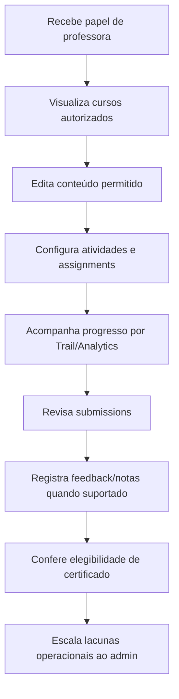

# Teacher Journey — Learning Core

## Pré-condições

- Professora/instrutor é `User` membro da `Organization`.
- Possui `Role` com direitos mínimos, preferencialmente limitados a cursos/assignments/usergroups necessários.
- Não deve receber permissões amplas de billing, infra, auth, storage global ou gestão irrestrita da organização.

## Fluxo Mermaid

## Permissões mínimas

- Ler cursos, capítulos, atividades e submissions do escopo.
- Criar/atualizar conteúdo somente dos cursos atribuídos quando necessário.
- Ler usergroups relevantes sem administrar toda a organização.
- Ler analytics/progresso do curso/turma quando disponível.

## Ações permitidas

- Preparar conteúdo em Course/Chapter/Activity.
- Configurar assignments e revisar submissions conforme RBAC.
- Monitorar progresso por TrailRun/TrailStep e dashboards existentes.

## Ações proibidas

- Alterar autenticação, sessões, billing, planos, domains, proxy, migrations ou modelos.
- Gerenciar papéis amplos sem aprovação.
- Emitir claims acadêmicos não verificados ou certificado com wording universitário.

## Riscos

- Direitos amplos demais em `Role.rights` podem permitir alteração de organização inteira.
- Analytics podem depender de eventos/Tinybird e não refletir presença real.
- Assignments existentes podem não cobrir rubrica NAVE IA sem adaptação futura.
