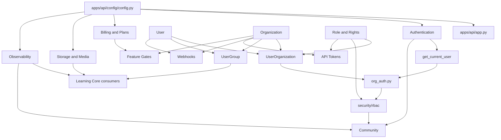
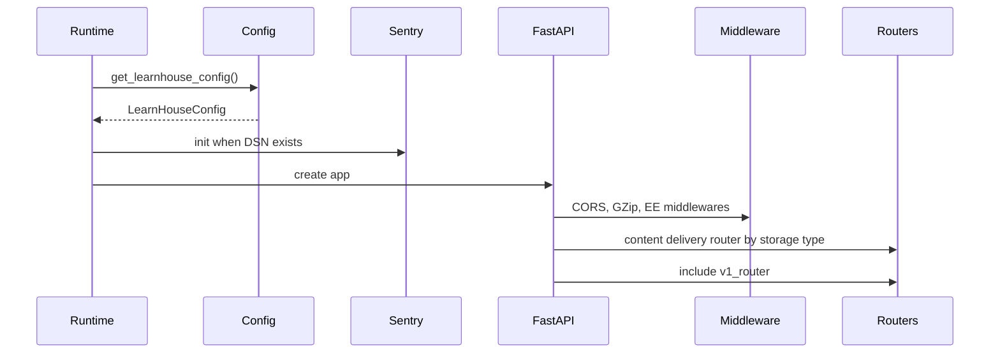

# Platform Core Dependency Map

## Diagrama Mermaid

## Dependências internas

| Capacidade | Depende de | Consumidores internos |
|---|---|---|
| Authentication | Config JWT, User, security utilities | Routers, org auth, API token utilities, frontend session services |
| Users | Database, password/security services, email verification/reset | Organizations, roles, usergroups, courses, communities, webhooks |
| Organizations | UserOrganization, Role, org config/cache | Learning resources, billing, API tokens, webhooks, custom domains |
| RBAC | Role/Rights, UserOrganization, org_auth, resource_access | Courses, assignments, communities, podcasts, boards, playgrounds |
| UserGroups | User, Organization, resource locks | Learning access locks and dashboard group management |
| Billing/Plans | Runtime plan catalog, billing usage events, organization config, payments config | Feature gates, SaaS/org plan screens, AI/pack entitlement checks |
| Media | Media DB, content delivery config, file validation | Course blocks, thumbnails, org assets, community media |
| Notifications | Mailing config, user email flows | Verification, password reset, billing emails |
| Observability | Sentry config, analytics services, health routers | Operators, product analytics, monitoring surfaces |
| API Tokens | Org, user, rights, token hashing | External integrations and automation |
| Webhooks | Org, user, encrypted secret, event publishers | Zapier and external automation |
| Feature Gates | Runtime plan configuration, usage, organization billing state | AI, packs, premium limits |

## Dependências externas

| Serviço externo | Uso | Obrigatoriedade |
|---|---|---|
| PostgreSQL/SQL database | Persistência principal | Crítica |
| Redis | Cache/infra configurável | Operacional quando configurado |
| Sentry | Erros, logs and traces | Opcional/operacional |
| Tinybird | Analytics | Opcional/operacional |
| Stripe | Pagamentos and subscriptions | Opcional/operacional |
| Resend/SMTP | Emails transacionais | Operacional para email |
| Filesystem/S3 API | Content delivery and media | Um backend requerido |
| Zapier/outbound HTTP | Webhook integrations | Opcional |

## Dependências críticas

1. Configuração (`apps/api/config/config.py`) feeds security, hosting, storage, payments, observability and email.
2. `Organization` + `UserOrganization` + `Role` form the tenant authorization spine.
3. Auth tokens identify users; org access is separate and must be checked per tenant action.
4. RBAC resource access is reused by product domains and cannot be forked locally.
5. Media/content delivery is a shared single path for file access.

## Pontos únicos de falha

| Ponto | Risco | Mitigação documental |
|---|---|---|
| JWT secret/config | Invalid sessions or security failure | Preserve centralized config and never version secrets. |
| Org membership checks | Cross-tenant access if bypassed | Require org_auth/RBAC helpers in domain services. |
| Role rights schema | Over/under-permissioned domains | Add rights by ADR and validator updates. |
| Content delivery backend | Media unavailability | Keep local/S3 abstraction and access-controlled routers. |
| Provider credentials | Billing/email/analytics outage | Store in env/config, not docs or code changes. |

## Ordem de inicialização conhecida

