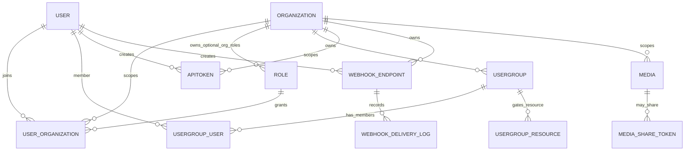

# Entity Relationship Mapping — Platform Core

## Diagrama Mermaid

## Entidades estruturais

| Entidade | Evidência | Responsabilidade | Escopo multi-tenant |
|---|---|---|---|
| Organization | `apps/api/src/db/organizations.py` | Tenant, slug, metadata and public org profile/config. | Root tenant boundary. |
| User | `apps/api/src/db/users.py` | Global identity, login fields, profile and principal projections. | Global user may relate to many orgs. |
| UserOrganization | `apps/api/src/db/user_organizations.py` | Membership bridge between User, Organization and Role. | Primary org membership boundary. |
| Role | `apps/api/src/db/roles.py` | Named rights bundle, global/org/org-token role type. | Optional `org_id`; org roles scoped to tenant. |
| Rights | `apps/api/src/db/roles.py` | Permission buckets and action flags. | Applied through org membership and resource checks. |
| UserGroup | `apps/api/src/db/usergroups.py` | Generic grouping primitive. | Organization-owned. |
| UserGroupUser | `apps/api/src/db/usergroup_user.py` | Membership in a group. | Must remain inside org context. |
| UserGroupResource | `apps/api/src/db/usergroup_resources.py` | Resource gate/lock. | Connects group to tenant resource UUIDs. |
| API Token | `apps/api/src/db/api_tokens.py` | Org-scoped programmatic credential with rights. | Explicit `org_id`. |
| WebhookEndpoint | `apps/api/src/db/webhooks.py` | Org webhook subscription endpoint. | Explicit `org_id`. |
| WebhookDeliveryLog | `apps/api/src/db/webhooks.py` | Delivery attempt record. | Inherits tenant via endpoint. |
| Media | `apps/api/src/db/media/media.py` | Shared media/file metadata. | Must be accessed through media authorization. |
| MediaShareToken | `apps/api/src/db/media/media_share_token.py` | Share-token support for media access. | Bound to media semantics. |

## Cardinalidades

- One `User` may have many `UserOrganization` memberships.
- One `Organization` may have many members, roles, groups, media records, API tokens and webhook endpoints.
- One `Role` may be assigned to many `UserOrganization` rows.
- One `UserGroup` may have many users and many gated resources.
- One API token belongs to one organization and one creating user.
- One webhook endpoint belongs to one organization and has many delivery logs.
- Runtime plan catalog and entitlement relationships are conceptual/runtime configuration, not a proven persisted plan entity cardinality. Organization billing state is represented through organization configuration and billing usage evidence.

## Escopo multi-tenant

`org_id` is the architectural boundary for Platform Core resources. Authentication establishes principal identity; authorization and tenancy are enforced later by membership, role, rights, resource access and service-level checks. Domains must not assume a valid login implies tenant access.

## Inferências marcadas

- **Inferência:** `Media` is shown under `Organization` because media access is used by tenant resources; follow-up should verify every media path preserves org/resource ownership.
- **Inferência:** plan catalog and entitlement data are runtime/configuration concepts evidenced by plan routers, feature utilities and org plan config, not a persisted plan database entity in this registry.
