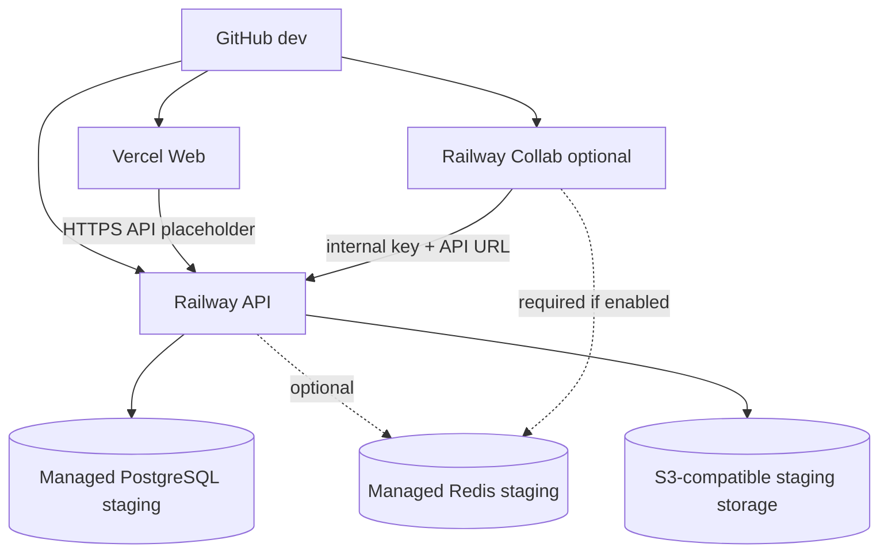

# Provider Placement

| Provider/service | Allowed | Forbidden | Required future action |
|---|---|---|---|
| Vercel Web | `NEXT_PUBLIC_*`, public URLs, public analytics IDs | DB URLs, JWT secrets, Redis URLs, AWS secrets, SMTP passwords, Stripe secrets, internal keys | Create project only in MISSION-012+ after approval. |
| Railway API | Runtime config, CORS, cookie/domain config, DB URL, JWT, Redis if needed, storage creds, optional integration secrets | Frontend-only build assumptions; production secrets | Create service and insert secrets manually in future mission. |
| Railway Collab | `COLLAB_PORT`, `LEARNHOUSE_API_URL`, `LEARNHOUSE_REDIS_URL`, `COLLAB_INTERNAL_KEY`, JWT only if code requires | Web public variables unrelated to Collab; DB URL unless code requires | Provision only if Collab MVP is approved. |
| Managed PostgreSQL | Staging database and credentials | Production data/credentials | Provision staging-only DB; migration plan is separate. |
| Managed Redis | Collab Redis or selected API cache features | Production Redis or unnecessary cache | Provision only if selected features require it. |
| S3-compatible storage | Staging bucket, endpoint, least-privilege keys | Public write bucket; credentials in URL | Provision bucket/CDN after storage decision. |
| GitHub | Source and future explicitly approved workflow secrets | Runtime provider secrets by default | No change in MISSION-011. |

## Mermaid topology

